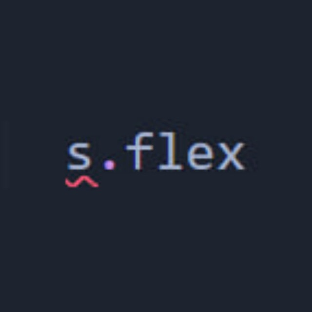

# Фронтенд сode style JoyTech. Критерии
&nbsp;&nbsp;

## Нейминг

:page_with_curl: Н1. Название переменных, параметров, свойств и методов записываются в нотации camelCase.

:page_with_curl: Н2. Названия констант (постоянных значений) записываются в нотации UPPER_SNAKE_CASE:
```jsx
const MAX_HEIGHT = 400;
const DEFAULT_TIME = 1000;
```

:page_with_curl: Н3. Массивы названы существительными во множественном числе:
```jsx
const frameworks = ['Next', 'Vue', 'JQuery'];
const evenNumbers = [2, 10, 44];
```

:page_with_curl: Н4. Название функции должно быть глаголом и соответствовать действию, которое она выполняет *(исключения - функции-обработчики/колбэки)*: 
```jsx
const getRandomNumber = () => Math.random();
const printNames = (names) => {
  names.forEach((name) => {
    console.log(name);
  });
};
```

:page_with_curl: Н5. Сокращённые названия переменных можно использовать, только если такое название широко распространено. Допустимые сокращения:
  - evt или e для объектов Event и его производных (MouseEvent, KeyboardEvent и подобные)
  - i, j, k, l, t для счётчика в цикле
  - cb для единственного колбэка в параметрах функции

## React

:page_with_curl: Р1. Структура каждого TSX-файла:
  - Импорты
  - Описание типа компонента (props)
  - Код компонента
  - Экспорты

:page_with_curl: Р2. Порядок написания кода компоненты: *стейты &rarr; store &rarr; api-запросы &rarr; остальная логика &rarr; содержимое компоненты*
```jsx
// Стейты
const [open, setOpen] = useState(false);
const [isVisible, setIsVisible] = useState(true);

// Store
const {name, setName} = useStore();

// API
const {mutate, isLoading} = useMutation(phoneCheckFetcher);
const {data} = useRegions();
const {data: dataProfile, isSuccess: isSuccessProfile} = useProfile();

// Остальная логика
// ...

// Содержимое компоненты
return (<MyComponent><MyComponent/>);
```

:page_with_curl: Р6. В компонентах отсутствует прямое обращение к DOM-элементам (например, document.querySelector). Если требуется получить доступ к DOM-элементу, применяются ссылки (ref).

## Next

:page_with_curl: С1. Чтение параметров из адресной строки проводится только через getServerSideProps:
```jsx
export async function getServerSideProps(params) {
  return {props: {...params.query}}
}

const MyPage = ({id}) => {
  console.log(id);
}

```

